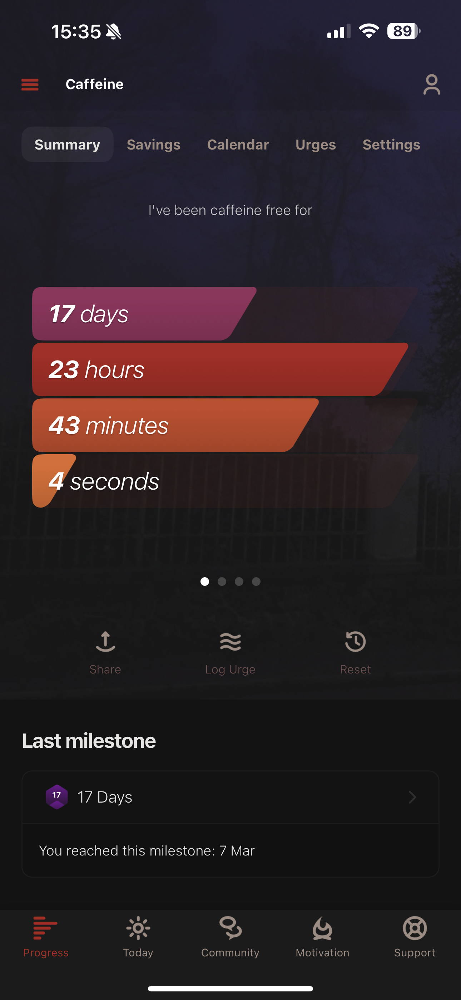
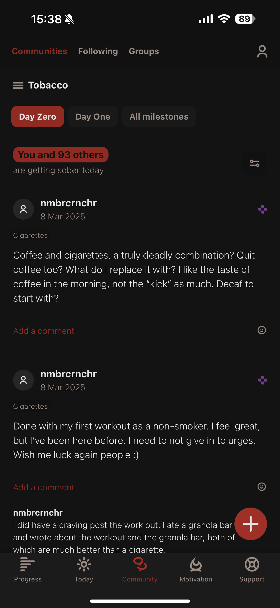
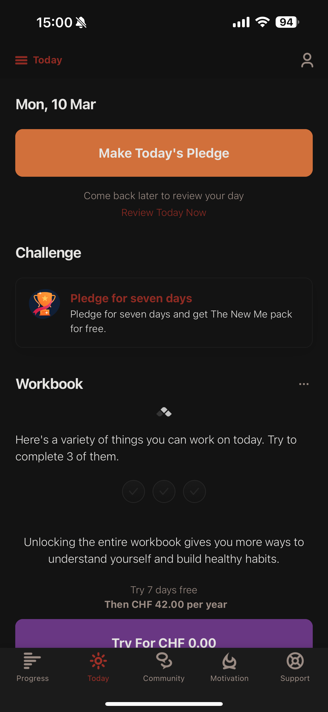
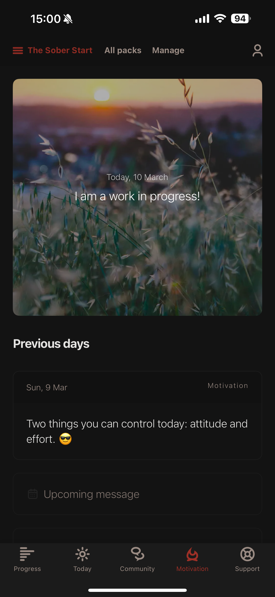
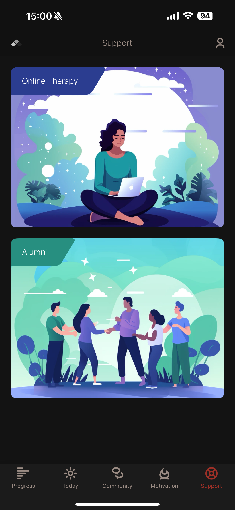
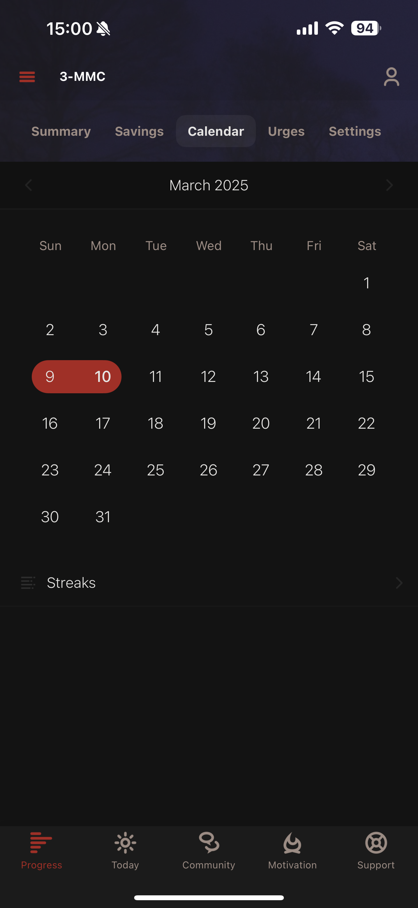
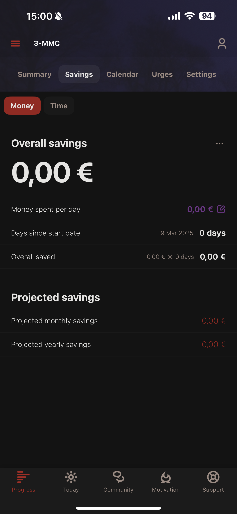

# Competitor Analysis: I Am Sober 
## General Information 
- **Name of System:** I Am Sober 
- **Company/Developer:** I Am Sober LLC 
- **Website/Product Page:** [\[URL\] ](https://iamsober.com/pt/site/home)
- **Version/Release Date:** 19 July 2013, Version 8.2.3 
- **Platform(s) Supported:** Web, Mobile (iOS/Android)
- **Target Audience:** Individuals seeking support in addiction recovery, including those aiming to quit or reduce substance use or harmful behaviors. 

--- 
## Core Functionality 

**Primary Purpose:** I Am Sober is a web and mobile application created to help people sustain sobriety and navigate addiction recovery, employing daily commitment principles and community support. 

**Key Features:** - Sobriety tracker - Financial saving calculator - Track milestones - Daily notifications for support - Daily pledges - Community support

**Unique Selling Points (USPs):** - [What makes this system stand out?] 
    - Allows users to monitor multiple addictions simultaneously
    - Daily pledges and motivational content personalized to the user and their addictions
    - Provides a platform for users to connect with each other, supporting and helping strangers with the same addiction

**Limitations/Weaknesses:** - [Any known shortcomings or pain points] 
    - Premium Features Require Subscription
    - Motivational packs become repetitive
    - Harmful or toxic comments within the community forums
---

## Screenshots

## Online Reviews
    mollyforbreakfast, 07/09/2021, 5 stars
such a comforting app
i absolutely adore this app. it’s interface is easy to use and clean looking. it’s really helping me keep track of my sobriety, with additional aiding quotes that the app sends me here and then. i love the community chat the most!! ❤️ people are so supportive and it really makes me feel like i’m not going through this journey alone. if you’re thinking of going clean, this app is for you, i recommend 100%. thank you sm ‘I am Sober’ app 😁🥰

    Inês Caleia, 13/09/2024, 5 stars
amazing
it helps me a ton, but the fact that it reset when i deleted the app, and that i needed to pay for that not to happen, was really annoying, still it’s an amazing app and i find people here are really supportive and you feel understood