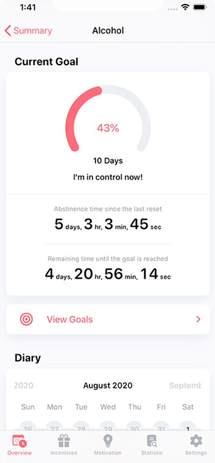
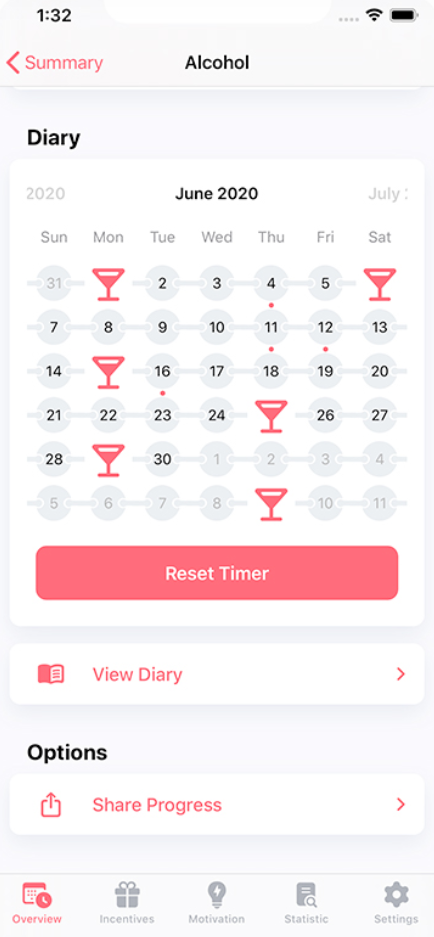

# Competitor Analysis: Quitzilla 
## General Information 
- **Name of System:** Quitzilla 
- **Company/Developer:** Andrii Hula​ 
- **Website/Product Page:** [\[URL\] ](https://www.quitzilla.com)
- **Version/Release Date:** 5/12/2020, Version 1.3
- **Platform(s) Supported:** Mobile (iOS/Android)
- **Target Audience:** Individuals aiming to quit or reduce substance use or harmful behaviors. 

--- 
## Core Functionality 

**Primary Purpose:** Quitzilla is created to help users overcome undesirable habits and addictions by offering tracking tools, motivational elements, and tailored insights​ 

**Key Features:** - Habit Tracking - Financial saving calculator - Motivational Support - Detailed Statistics - Diary Feature

**Unique Selling Points (USPs):** - [What makes this system stand out?] 
    - Users can customize the app to meet their individual requirements, establishing personal goals and motivations for cessation
    - By emphasizing the monetary benefits linked to breaking a habit, Quitzilla offers users another motivation
    - The application features a sleek and user-friendly design, ensuring it is accessible and straightforward for individuals of any age

**Limitations/Weaknesses:** - [Any known shortcomings or pain points] 
    - Limited Free Version
    - Lack of Community Support
    - Absence of Craving Management Tools
---

## Screenshots

## Online Reviews
    Gustavo Costa, 12/11/2024, 5 stars
A great app for overcoming addictions. The calendar is easily visible, allowing you to track your progress effortlessly. Additionally, you can set goals and monitor your abstinence time. The "age clock" serves as a great reminder of how short life is and that we should make the most of it. There is also a statistics section and an achievements tab.

    C3P643, 07/09/2022, 3 stars
The app itself is good; it fulfills its purpose and accurately shows how long you have refrained from a certain habit. However, I believe it lacks two crucial aspects for an app with this goal: a better interface and more effective affirmations. These two aspects can and should be improved—the interface is too simple, and the motivational messages should appear more frequently and be genuinely useful (I say this because, for me, they weren’t).